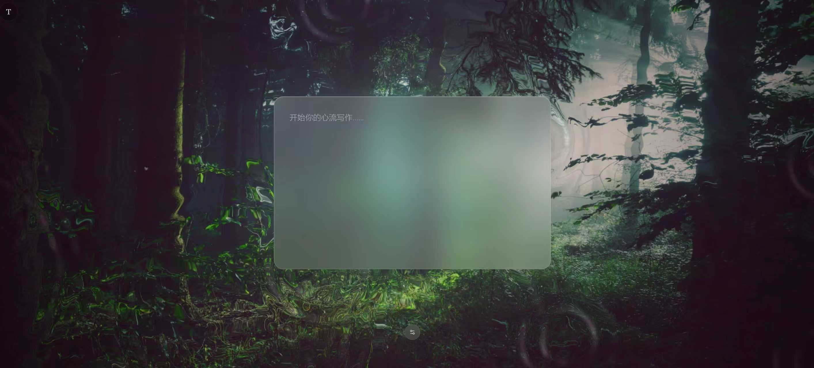

# 🌫 FlowSpace

### 在森林、水纹与安静之间，开始你的心流写作。

 

  

> **开始你的心流写作……**  
> 一个偏沉浸式的情绪表达空间。  
> 让文字像水波一样慢慢散开。

 

`沉浸` · `安静` · `流动` · `自我对话`

---

## 项目简介

FlowSpace 是一个偏沉浸式的写作应用。  
它想做的不是普通记事本，而是一个让人可以慢下来、整理情绪、安静表达自己的空间。

整个视觉灵感来自：

- 森林
- 雾气
- 水波
- 毛玻璃界面
- 安静流动的光影氛围

---

## 设计关键词

- 沉浸式写作
- 情绪表达
- 森林氛围
- 水波流动
- 玻璃拟态
- 专注体验

---

## 预览效果

  

---

## 功能方向

- 沉浸式背景视觉体验
- 中央毛玻璃写作面板
- 安静柔和的输入氛围
- 溪水 / 雨声 / 森林环境音效
- 情绪记录与内容保存
- 专注写作模式

---

## 产品目标

这个项目想解决的，不只是“写字”这件事。  

它更想做的是：  
让用户在一个安静、柔和、不会打扰人的界面里，慢慢把脑子里的杂音放下来，进入更自然的表达状态。

---

## 技术方向

- React / Vite
- Tailwind CSS
- Shader / Canvas 动效
- Web Audio 环境音
- Local Storage 本地保存

---

## 项目愿景

这不是一个普通输入框。  

它更像一个安静的角落。  
一个可以放空、整理、记录、和自己待一会儿的小空间。

---

## Status

Currently in building.
